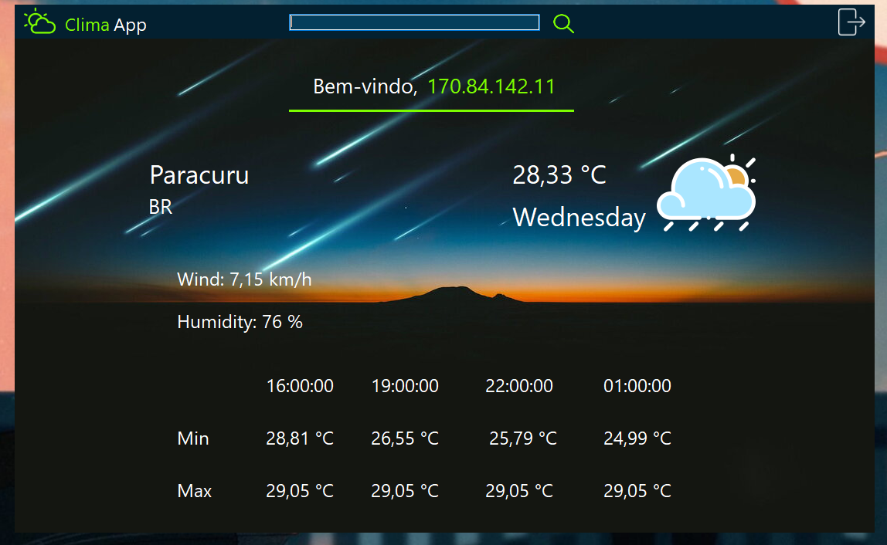
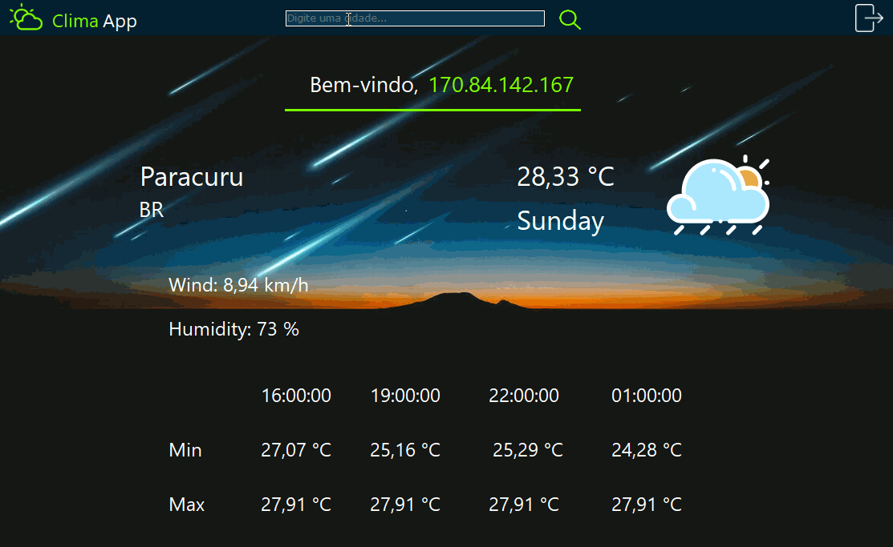
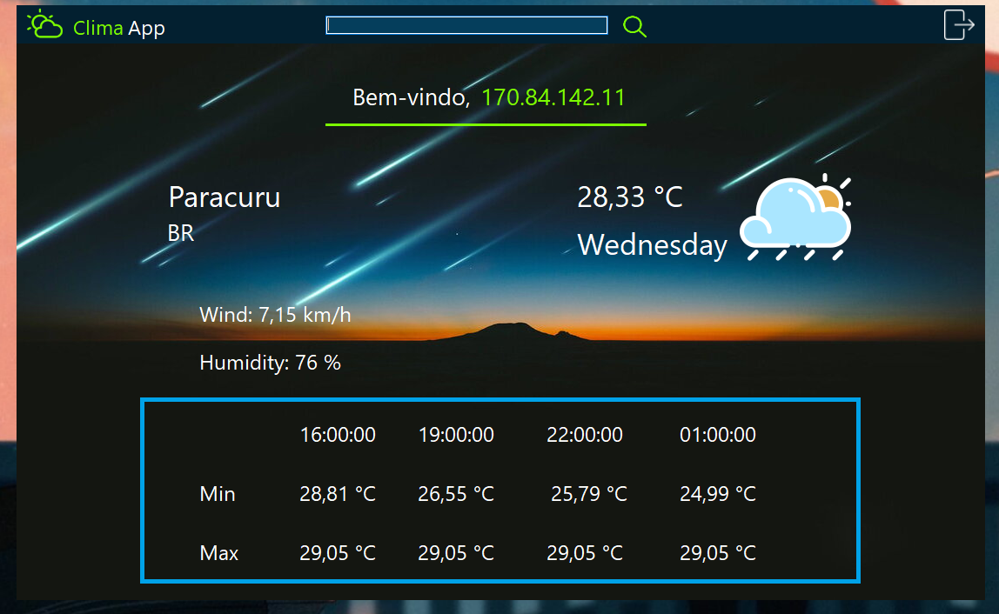

# ☂️ Weather-Monitor ☁️

## 📌Sobre

<h3>Aplicativo de previsão de tempo desenvolvido em C# utlizando a API da <a href="https://openweathermap.org/api">OpenWeather</a></h3>

## 📌Tabela de conteúdos
=================
   * [Sobre](#sobre)
   * [Como usar](#como-usar)
      * [Geolocalização](#geolocation)
      * [Pesquisa](#search)
      * [Previsão de 3 em 3 horas](#forecast)
   * [Tecnologias](#tecnologias)
   * [Como instalar](#install)
   * [Autor](#autor)

<h1 align="center">🚧Status: Concluido🚧</h1>

## 📝Funções
- [x] Geolocalização pelo IP
- [x] Campo de busca por outras localidades
- [x] Forcast de 3 em 3 horas

## 📌Como Usar

### 🗺️Geolocalização

✔️Ao inicilizar a aplicação, esta calcula a posição do usuário a partir de eu número IP (IP Adress),

  Esta funcionalidade é feita com a manipulação da API <a href="https://ipinfo.io/">IPInfo</a>

<h1 align="center">    
</img>
</h1>

### 🔎Acessando outras localidades

✔️Barra de pesquisa para selecionar locais de interesse ao usuário podendo ser países, estados e cidades.
Assim atualizando informações de humidade, velocidade do vento e a previsão de 3 em 3 horas ao selecionar a localidade em questão

</img>

### ⌚Forcast🌡️

✔️Previsão da temperatura mínima e máxima baseado num padrão de 3 horas de diferença entre cada uma.

</img>
